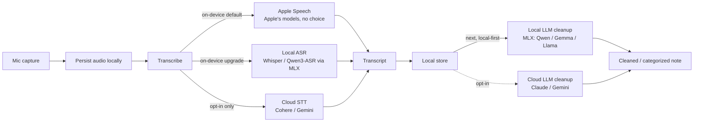

# Relay Notes: Voice-to-Text iOS Build Plan

iOS-native (SwiftUI), iPhone 15 Pro Max first. Cross-platform and any paid product are explicitly deferred.

This doc is the **plan and the why**. The chronological "what shipped" narrative lives in [CHANGE_LOG.md](../CHANGE_LOG.md); transcription dial rationale lives in [transcription-tuning.md](./transcription-tuning.md). Bulky reference material (the cleanup-model research, the empirical tuning log) is in the [Appendix](#appendix) and linked from the body.

> [!important] Current POV (2026-06-14): transcription is done — the cleanup model is next
> v1 voice-to-text is built and on-device. **Apple Speech is the permanent default** — it works the instant the app is installed (no model download) and iOS 27 promises a stronger on-device recognizer. Whisper and Parakeet stay as opt-in on-device upgrades, but the default is settled, not pending an A/B.
> **The next bet: stop chasing raw transcription accuracy; mitigate it with an on-device cleanup model.** A messy Apple-Speech transcript cleaned by a local LLM should beat a marginally-more-accurate raw transcript — and it unlocks much more (de-filler, structure, categorize). This is a **hypothesis to test next** (L1/L2), not a settled fact. Prior art: **Google AI Edge Eloquent** ships exactly this shape (on-device Gemma ASR + on-device LLM cleanup, optional cloud Gemini for stronger cleanup) and it works well — see [References](#references).

> [!info] Three constraints that shape the build
> 1. **Local-first by default. Cloud is opt-in.** The app must be fully functional with no network. Cloud STT and cloud LLM enrichment are *upgrades*, not requirements. Default flow: mic → on-device transcribe → on-device store.
> 2. **On-device ≠ Apple-only.** Apple Speech is the **locked default** because it ships with iOS (zero setup), but third-party local models (Whisper, Parakeet via MLX) are *also* on-device — opt-in upgrades, not the default. "Where it runs" (on-device vs cloud) and "whose model" (Apple's vs your-choice) are independent axes.
> 3. **First and foremost it works for me.** v1 ships to my own phone via Developer Mode sideload (free Apple ID tier). TestFlight, the paid Apple Developer Program, App Store, and pricing are later, optional concerns — each tied to a concrete trigger, not a date.

> [!tip] The load-bearing principle
> **Provider abstraction from day one.** Every external capability sits behind a protocol so the runtime provider is swappable without a rebuild — `Transcriber` today, `LanguageModel` for the cleanup model next. "Which provider" is a runtime choice. This is the spine; preserve it.

---

## Where we are now (2026-06-14)

v1 voice-to-text is **built and on-device**. Tap → speak → stored transcript works, with three interchangeable on-device engines selectable in Settings:

- **Apple Speech** (**permanent default**) — `SpeechAnalyzer` + `SpeechTranscriber`, streams live partials while recording; works the instant the app is installed, no model download. iOS 27 promises a stronger on-device recognizer.
- **On-device Whisper** — `whisper-small.en` (481 MB FP16) via raw `mlx-swift`, downloaded on first use into Application Support, finalize-only decode (no live partials — placeholder UX while recording). Opt-in upgrade.
- **On-device Parakeet** — NVIDIA `parakeet-tdt-0.6b-v2` (FastConformer + TDT, ~2.4 GB downloaded) via raw `mlx-swift`, also finalize-only (T2, device-validated 2026-06-14). Opt-in upgrade. Published WER puts it above Whisper, though the field read was closer — see [Appendix B](#b-v11-accuracy-tuning-empirical-log).

Daily-driver UX shipped: chronological list, detail view with audio playback, delete (row + audio file), search, optional title, share. The provider spine is in place and load-bearing: `Transcriber` (file + streaming), `TranscriptionEngine` + `TranscriberFactory` (with single-live-MLX-engine eviction so Whisper/Parakeet are never co-resident), the `TranscriptionOptions` sum type, per-engine settings bundles (Approach C), and the `ModelStores` registry that gates each engine on its model's presence. Persistence is SwiftData (`Note`) + audio files referenced by filename. Verified by 149 simulator tests (MLX paths are device-only) plus device validation on the iPhone 15 Pro Max.

**Next — the cleanup model (L1/L2).** The strategic bet: rather than chase a better transcriber, mitigate transcription errors with an on-device LLM cleanup pass. v1 keeps dogfooding via sideload (V1.3) in parallel ([Appendix C](#c-t1-measurements--whisper-smallen-on-device-t13) has the Whisper on-device cost numbers). The old "accuracy-ladder A/B to pick the default engine" is **retired** — Apple Speech is the permanent default, and accuracy now comes from cleanup, not from swapping transcribers. (Field read after T2, qualitative single-observer: Apple fastest / least accurate but usable; Parakeet a bit faster than Whisper; Whisper a bit more accurate — all three usable, none worth dethroning Apple.)

---

## The pipeline



**v1 is the solid path:** mic → persist → transcribe → store. The cloud STT branch (`C3`) is opt-in, off by default, and now deprioritized behind cleanup. **The cleanup stage (`G1`) is the active next phase** — same local-first / opt-in-cloud pattern: local MLX cleanup as the default, cloud (`G2`) opt-in. Apple Foundation Models are intentionally *not* the primary cleanup engine (the open-source ecosystem leads on capability in 2026).

---

## The spine

### v1 — `Transcriber` (current)

```swift
nonisolated protocol Transcriber: Sendable {
    // File-based. Reserved for cloud STT and a future "re-transcribe this note" action; unused by the app today.
    func transcribe(_ audio: URL, options: TranscriptionOptions) async throws -> String
    // Live. What the recorder uses; returns a session the audio engine feeds.
    func makeStreamingSession(options: TranscriptionOptions) async throws -> any TranscriptionSession
}

enum TranscriptionOptions: Sendable {
    case apple(AppleSpeechOptions)   // preset + contextual strings
    case whisperMLX                  // no decode dials in v1
}
```

- Two methods, both intentional — file-based stays for the cloud/re-transcribe paths even though the app only uses streaming today. Don't delete it as dead code.
- `TranscriptionOptions` is a **sum type**, not a struct with nullable fields — each engine's options stay type-safe and it mirrors `TranscriptionEngine`. Per-engine settings live in bundles on `Tunings` (Approach C, see transcription-tuning.md).

Providers (interchangeable behind the protocol):
- **`AppleSpeechTranscriber`** — on-device, Apple's models. **Permanent default** (zero-setup; iOS 27 strengthens it).
- **`WhisperMLXTranscriber`** — on-device, your-choice model via raw `mlx-swift`. The upgrade when Apple's accuracy is the bottleneck and staying local matters.
- **`CloudTranscriber`** — cloud, opt-in only (Cohere / Gemini). Off by default. *(T3, not built.)*

### Next — `LanguageModel` (the cleanup model)

```swift
protocol LanguageModel {
    func clean(_ raw: String) async throws -> String
    func categorize(_ note: String, into allowed: [String]) async throws -> Categorization
}
```

Same local-first / cloud-opt-in pattern: **`LocalModel`** (MLX primary, llama.cpp fallback, LiteRT-LM as a third) is the default cleanup path; **`CloudModel`** (Claude / Gemini) is opt-in; **`AppleFoundation`** is an optional fourth, *not* the default (see [Appendix A](#a-the-cleanup-model--engine--model-research)). Centralize the prompt and pin a fixed category taxonomy so swapping providers never changes behavior — the model picks from `allowed`, it never invents categories.

---

## Build roadmap

Sequenced for ~12 hrs/week, iPhone-first. Completed stages are one-liners — the detail is in CHANGE_LOG.

### v1 — voice-to-text on my phone

- [x] **V1.0 Skeleton** — SwiftUI app builds + sideloads. *(2026-06-08)*
- [x] **V1.1 Capture + transcribe** — `AVAudioEngine` → AAC/m4a + `SpeechAnalyzer` streaming → SwiftData; mic/speech permissions; runtime-tunable accuracy knobs. *(2026-06-08)*
- [x] **V1.2 Transcription UX** — list, detail + playback, delete (row + audio), search, optional title, share, live-streaming partials (Apple). *(2026-06-08/09)*
- [ ] **V1.3 — Dogfood via sideload.** Build to the phone via Developer Mode and use it as the real notes app. Free Apple ID tier (bundle expires every 7 days; re-plug and re-run, data container persists). No paid program yet.
  *Done when: it's on the home screen and used daily for a week or two.*
- [ ] **V1.4 — TestFlight (optional, gated).** Enroll in the Apple Developer Program ($99/yr) and ship a TestFlight build. **Trigger:** wanting to hand the app to someone else, or the 7-day re-plug cycle becoming friction. No longer Whisper-memory-gated — `small.en` runs without the increased-memory-limit entitlement (validated 2026-06-10).
  *Done when: installed via TestFlight, no Mac re-plug for weeks.*

### Transcription upgrades (ahead of L stages)

Promoted ahead of L1 on 2026-06-10: **third-party-model on-device viability is the riskiest unknown of the local-first thesis**, and the runtime wired here (raw `mlx-swift`) is the same one L1+ needs for local LLMs. Do the hard thing first, on a smaller problem than an LLM.

- [x] **T1.0–T1.2 — Local Whisper wired end-to-end, device-validated.** Provider plumbing (sum type, `TranscriberFactory`) → `WhisperModelStore` (download / integrity / delete) → cached `actor` transcriber → chunked timestamp-guided decode (handles >30 s audio) → finalize-only streaming session → Settings download/delete UI + engine gating → recorder placeholder UX. Weights are download-only (`.app` ~74 MB). Device-validated on the iPhone 15 Pro Max through 2026-06-12. Per-substage detail in CHANGE_LOG; dial/port rationale in transcription-tuning.md.
- [x] **T1.3 — Validation + measurements + decisions log.** *(2026-06-13)* On-device smoke (`MLXSmoke`) asserts the bundled WAV decodes to the expected substring (PASS), then measures 1-min/5-min decode on the iPhone 15 Pro Max. Headline: ~4× realtime (5-min note ≈ 80 s decode), memory bounded + flat across length (~2.8 GB footprint, mostly reclaimable MLX cache; ~464 MB live). Full numbers in [Appendix C](#c-t1-measurements--whisper-smallen-on-device-t13); Decisions-log row in transcription-tuning.md. **`small.en` retained** as default — numbers don't demand a smaller variant. Battery delta deferred (can't measure cleanly while tethered/charging).
- [x] **T2 — Second on-device engine (done; device-validated 2026-06-14).** **NVIDIA Parakeet `tdt-0.6b-v2` via raw `mlx-swift`** (FastConformer encoder + TDT/RNN-T decoder, 617M params, CC-BY-4.0, `mlx-community/parakeet-tdt-0.6b-v2`) — chosen over Qwen3-ASR (best English WER of the candidates, a complete MIT mlx-swift reference port already exists, all required ops native in mlx-swift, weights load straight from safetensors). Ported from `FluidInference/swift-parakeet-mlx`, cross-checked against the Python `senstella/parakeet-mlx`. Validates runtime-extensibility on a smaller problem than an LLM and gives an English accuracy ladder above `whisper-small.en`. Staged + shipped: T2.1a–e (model port) → T2.2 (generalize the download store → `DownloadableModelStore(spec:)`) → T2.3 (per-engine gating via the `ModelStores` registry) → T2.4 (single-live-MLX-engine eviction) → T2.5 (wire end-to-end behind the provider spine). **Memory (device-measured):** bf16 resident floor **~1.28 GB**, full-model forward peak **~1.34 GB** — fits the 8 GB device **without** the `increased-memory-limit` entitlement, *provided* weights are cast-and-released incrementally (the reference's load-then-cast-all path holds F32 + bf16 ≈ 3.7 GB and OOMs at the ~3 GB ceiling). The featurizer settled to preemph 0.97 / periodic Hann / **L1** magnitude / Slaney mel scale; `ls_test.flac` decodes word-perfect. Parakeet is now selectable in Settings, records, and is a re-transcribe target on the iPhone 15 Pro Max. Detail in `CHANGE_LOG.md` (2026-06-13/14) and `planning/plan.T2.md`. *Done when: a second on-device engine is selectable and produces transcripts on the phone — ✅.*
- [ ] **T3 — Cloud STT (`CloudTranscriber`).** Cohere as accuracy primary, Gemini for diarization-heavy clips. **Off by default**, explicit opt-in with a one-time data-leaves-the-device disclosure. **Deprioritized 2026-06-14** — behind the cleanup model; cloud STT accuracy matters less if local cleanup mitigates STT errors.
  *Done when: with the toggle on, a transcript comes back from a remote provider; with it off, no network call leaves the device.*

### Next — the cleanup model (LLM enrichment)

**Promoted to the active next phase (2026-06-14)** — ahead of T3. The bet: an on-device LLM cleanup pass mitigates transcription errors, so accuracy comes from cleanup rather than from chasing a better transcriber. Extends the same provider pattern to `LanguageModel`. Engine/model research is in [Appendix A](#a-the-cleanup-model--engine--model-research); prior art is Google AI Edge Eloquent ([References](#references)).

- [ ] **L1 — Inference spike.** Wire on-device LLM generation via **`mlx-swift-examples` (`MLXLLM`/`MLXLMCommon`)** — its model factory covers many LLM arches + HF download + chat templates, so this is an SPM-dep + API call, **not** a hand-port (unlike Whisper/Parakeet). (`LocalLLMClient` or raw `mlx-swift` are fallbacks.) Download a model from HF — primary **Gemma 4 E2B** (proven for this task in Edge Eloquent), **Qwen 3.5 4B** the fallback — generate on the 15 Pro Max, add the `increased-memory-limit` entitlement. Measure tok/sec, load, memory, battery. **Gating check:** Gemma 4 is new — confirm `mlx-swift-examples` implements its arch (Eloquent runs Gemma on LiteRT, not MLX), else fall back to Qwen 3.5 4B. *Riskiest integration — prove it first; L2's harness builds directly on it.*
- [ ] **L2 — Cleanup pass + the core test.** Local model behind `LanguageModel`; messy spoken note in, clean note out (de-filler, fix run-ons, light structure). **Deliverable: a device-only `LLMCleanupSmoke`** (mirrors `MLXSmoke`/`ParakeetSmoke`) — fixed real Apple-Speech transcripts × candidate **MLX** models, runs the centralized cleanup prompt, prints before/after + tok/s + peak footprint. **Apples-to-apples** (real device + shipping runtime + deployable quant), so results transfer — unlike Ollama-on-Mac (different runtime/quant/hardware; a quality smell-test only). Ceiling-check the same fixtures against a cloud model. **The validation that justifies the pivot:** does on-device cleanup mitigate STT errors enough that raw-transcriber accuracy stops mattering? Full plan + handoff: [`plan.L2.md`](./plan.L2.md). (Gemma-via-LiteRT is the separate [#10](https://github.com/AlteredCraft/relay-notes/issues/10) track.)
- [ ] **L3 — Categorize / organize.** Pinned taxonomy. Local or cloud.
- [ ] **L4 — Cloud enrichment.** `CloudModel` + an offline queue that drains on reconnect; cloud STT accuracy pass.
- [ ] **L5 — Optional.** Apple Foundation Models provider, LiteRT-LM (Gemma 4 E2B), or a LoRA fine-tune via MLX.

---

## Architecture notes

### v1

- **Principles** — local-first / cloud-opt-in, on-device-≠-Apple-only, provider abstraction — are the intro callouts + "The spine" (all shipped); not repeated here.
- **Transcription off the main thread.** Capture and transcription run async; the view never blocks. Apple streams partials into the view; the MLX engines decode once at finalize.
- **Local-first persistence.** SwiftData for transcripts; audio files in the container, referenced by **filename** (not absolute URL — the container path can shift between launches). `Note.deleteWithAudio(in:)` is the canonical delete.

### Next (the cleanup model)

- **Local-first by default; cloud is opt-in.** Same as transcription. Local LLM (MLX) is the default cleanup path; cloud is an explicit upgrade.
- **Engine abstraction from day one of the L stages.** MLX primary, llama.cpp fallback, LiteRT-LM third, Apple Foundation optional fourth — all behind `LanguageModel`. Models land as MLX / GGUF / LiteRT at different times; multi-engine covers all.
- **Why not Apple-only:** Apple's on-device LLMs lag the open-source ecosystem (Qwen, Gemma, Llama) on capability as of 2026. Easiest to integrate, least capable. Default is your-choice via MLX.
- **Runtime model management.** Download from Hugging Face into the container; bundle at most one small default for first-run offline. **Generation off the main thread**, streaming tokens into the view. Prompt + taxonomy centralized so every provider imports them.

---

## Watch-items

> [!warning] v1 risks (voice-to-text)
> - **Apple Speech setup.** On-device recognition requested explicitly; locale + authorization handled. Permissions `NSMicrophoneUsageDescription` / `NSSpeechRecognitionUsageDescription`; audio session configured. *(Shipped.)*
> - **Background recording.** Locked-screen capture works — `audio` background mode via the partial `Info.plist`; `AVAudioSession` interruption handling (call/alarm/Siri → pause + auto-resume) shipped 2026-06-09. **Still open:** audio route changes (e.g. unplugging headphones) and on-device validation of the backgrounded-during-a-call path.
> - **Single-platform lock-in.** Revisiting cross-platform later means a rebuild — the conscious tradeoff for shipping the best thing on the phone now.

> [!warning] T1 risks (Local Whisper via MLX)
> - **In-memory PCM buffer ceiling.** `WhisperMLXTranscriber` accumulates PCM in memory and decodes at `finish()` — ~115 MB for a 30-min recording on the 15 Pro Max. Fine, not unbounded. Revisit trigger: recordings >20 min, memory-pressure warnings under dogfood, or expanding the device target. Tracked in [#1](https://github.com/AlteredCraft/relay-notes/issues/1).
> - **Model download is a ~481 MB step.** `mlx-community/whisper-small.en-fp16` (`model.safetensors`, pinned commit, SHA-verified) lives in Application Support (not Caches — evictable), excluded from iCloud backup. Settings exposes pre-download + delete to keep the offline-recording promise once installed.
> - ~~`increased-memory-limit` entitlement vs free-tier sideload.~~ **Resolved 2026-06-10:** not required for `small.en` FP16 on the 15 Pro Max (validated end-to-end without it). Still applies to L1+ MLX LLMs (3–4B Q4 ≈ 2.5 GB), but Whisper alone doesn't trip it.

> [!warning] Later risks (LLM enrichment, when it resumes)
> - **iOS memory limits.** Even with the entitlement, 8 GB is tight — 3–4B Q4 is the ceiling. Test for jetsam kills under real use.
> - **`LocalLLMClient` is experimental.** Keep the roll-your-own path (mlx-swift + llama.cpp xcframework) as a fallback if it churns.
> - **Format availability lag (MLX / GGUF / LiteRT-LM).** Engine abstraction is what makes a new model in one format a non-issue.
> - **First-load latency + licensing.** First run compiles/loads — show progress. Re-check the model license if this ever becomes paid (Gemma 4 E2B / Qwen 3.5 are Apache 2.0 per their cards — verify per model).

---

## References

- **Brown CCV — Comparing speech-to-text models:** https://docs.ccv.brown.edu/ai-tools/services/transcribe/comparing-speech-to-text-models — Cohere Transcribe (5.42% WER, best published), Qwen3-ASR (5.76%, faster than Whisper), Whisper (7.44%), Gemini (strong diarization). Backs the v1 cloud-STT plan: Cohere for accuracy, Gemini for diarization.
- **Gemma 4 E2B (LiteRT-LM):** https://huggingface.co/litert-community/gemma-4-E2B-it-litert-lm — Google's on-device LM (~2.5 GB full / ~0.8 GB text-only, Apache 2.0), LiteRT-LM runtime, official iOS support. A row in L5; evaluated in [issue #10](https://github.com/AlteredCraft/relay-notes/issues/10).
- **Google AI Edge Eloquent (prior art for the cleanup model):** https://apps.apple.com/us/app/google-ai-edge-eloquent/id6756505519 — Google's offline-first iOS dictation app (launched ~2026-04). On-device **Gemma-based ASR + on-device LLM cleanup** (strips fillers, rewrites for intent vs verbatim), optional **cloud Gemini** for stronger cleanup, transform modes (Key points / Formal / Short / Long), Gmail-sourced custom dictionary. Direct validation of Relay Notes' next bet — local capture + local cleanup, cloud as an opt-in upgrade — and the bar to measure against.

---

## Content angle

Every phase is an AlteredCraft post. **v1:** local-first design on iOS in 2026, the Apple Speech on-device floor, `SpeechAnalyzer`/`SpeechTranscriber` in SwiftUI for a TypeScript developer, runtime accuracy tuning as a debug surface, file-based vs live-streaming STT, on-device-but-not-Apple (Whisper via MLX), the STT model landscape. **Later:** MLX vs llama.cpp vs LiteRT-LM on a real iPhone, runtime model swapping from HF, the local-capture-cloud-enrich pattern, building a local cleanup model (and how it stacks up against Google AI Edge Eloquent). *The build funds the content.*

---

# Appendix

## A. The cleanup model — engine + model research

The local-LLM-on-device research backing the cleanup phase — **now the active next work** (see roadmap). Still current; validate against the real captured notes that dogfooding (V1.3) is producing.

**Inference engine.** For "my choice of local model" on Apple silicon the 2026 consensus is **MLX primary, llama.cpp fallback**, with **LiteRT-LM** (Google's on-device runtime, ships Gemma 4 E2B with official iOS support) as a third to compare.

> [!important] Why not Apple Foundation Models as the primary engine?
> As of mid-2026 Apple's on-device language models lag the open-source ecosystem (Qwen, Gemma, Llama) on capability and instruction-following. Easiest to integrate (no download, no entitlement gymnastics) but the *least capable*. Treated as a fourth, optional engine — not the default.

- **MLX** — fastest and simplest from Swift; `mlx-community` ships conversions of new models quickly; the only local path that supports LoRA fine-tuning on your own notes.
- **llama.cpp (GGUF)** — the universal fallback; broadest format ecosystem; ~15–30 tok/sec on A17 Pro+ via Metal.
- **Runtime download from HF**, not bundled — the model picker is just a list of repo ids; a better model drops, you add an id, no app update. Optionally bundle one small default for first-run offline.
- **Ready-made:** `LocalLLMClient` (tattn, MIT) wraps GGUF + MLX with streaming + HF download (experimental). Alternative: a thin protocol over `mlx-swift` + a vendored `llama.cpp` xcframework.

**Models for the iPhone 15 Pro Max (8 GB).** Sweet spot is 2–4B at 4-bit (~2.5 GB, snappy). Primary **Gemma 4 E2B** (edge-built, Apache 2.0, the family proven for cleanup in Edge Eloquent); fallback **Qwen 3.5 4B** (newer-gen, dense, well-supported in MLX). Add the increased-memory-limit entitlement and test for jetsam under real use. (MoE models like Gemma 4 26B-A4B don't fit — all experts must be resident, so *total* params gate the phone, not *active*.)

**Cleanup / categorize tiers** (sequencing within the Later work):

| Tier | What | How | When |
|---|---|---|---|
| 0 | Validation, no app | Run candidate MLX models on real notes; sanity-check the ceiling with a cloud model | L0 |
| 1 | One local model | MLX behind `LanguageModel`, downloaded from HF | L1–L2 |
| 2 | Model picker | Multiple HF models, runtime download, llama.cpp fallback | L2+ |
| 3 | Cloud enrichment | Cloud frontier when online, local offline fallback, queue drains on reconnect | L4 |
| 4 | Optional | Apple Foundation Models, LiteRT-LM (Gemma 4 E2B), or a LoRA fine-tune via MLX | L5 |

**Transcription tiers** (for reference — Tier 1 + 2 are built; Tier 3 is T3):

| Tier | Provider | Where | Model choice | When |
|---|---|---|---|---|
| 1 | Apple Speech (`SpeechAnalyzer`) | on-device | none (Apple's) | v1 ✅ |
| 2 | Local ASR via MLX (Whisper + Parakeet; Qwen3-ASR a sanity-check only) | on-device | your choice (HF repo id) | T1 ✅ (Whisper) · T2 ✅ (Parakeet) |
| 3 | Cloud STT (Cohere / Gemini) | cloud (opt-in) | provider's hosted | T3 — off by default |

## B. V1.1 accuracy-tuning empirical log

Per-knob outcomes observed when turning the Apple-Speech dials. *What each dial does and why its default* is in [transcription-tuning.md](./transcription-tuning.md); this is *what we found by turning them.* Out-of-box defaults: `.default` · 64 kbps · basic preset · no contextual strings.

| # | Knob | Values to try | Status | Outcome |
|---|---|---|---|---|
| 1 | Audio session mode | `.default` / `.measurement` / `.voiceChat` / `.videoRecording` | partly done | `.measurement` is noticeably quieter (disabled AGC) with no observable STT win in tested noisy conditions. Reverted default to `.default`; `.measurement` stays an opt-in for STT testing. |
| 2 | AAC bitrate | 32 / 64 / 96 / 128 / 192 kbps | n/a | Doesn't affect transcription in the streaming path (both engines transcribe live PCM, not the saved `.m4a`) — a playback/storage dial only. |
| 3 | Transcription preset | basic / withAlternatives / progressive | not started | — |
| 4 | Contextual biasing | comma-separated domain words | not started | — |

Notes: mode + bitrate are cheap capture/storage knobs; preset + biasing are Apple-Speech-only recognizer knobs (inert under Whisper). Tuning state persists via `UserDefaults` (per-property `didSet`; `init` reads back). Engine-scope detail in transcription-tuning.md § "Engine relevance."

### Engine comparison — Apple vs Whisper vs Parakeet (field trials)

- **2026-06-12** — Field-trial impression: Apple Speech is performing at least as well as Whisper (`small.en`), possibly better. Qualitative, single-observer, real-use dictation — not a measured WER on a fixed corpus. Worth noting because Apple is the cheaper path (no 481 MB weights download, no MLX memory footprint); if the on-device accuracy gap stays this small in daily use, it weakens the case for Whisper as the default engine. Revisit with a controlled A/B (same audio through both engines) before drawing a firm conclusion. **Tool for this:** `NoteDetailView`'s "Re-transcribe" menu (2026-06-12) re-runs a saved note's audio through the other engine and shows a current-vs-new comparison — the in-app substrate for the same-audio A/B. The persisted audio is what makes it possible (issue #4: audio kept as a debug/tuning asset).
- **2026-06-14** — Three-way field read after Parakeet shipped (qualitative, single-observer, real use): **Apple Speech fastest, least accurate but usable; Parakeet slightly faster than Whisper; Whisper slightly more accurate than Parakeet** — note this inverts the published-WER expectation (Parakeet leads on paper), so a fixed-corpus check is the tiebreak if it ever matters. **Decision: Apple Speech is the permanent default; the A/B-to-pick-a-default is retired.** None of the three is worth dethroning Apple on a zero-setup basis, so the project pivots to mitigating STT errors with an on-device **cleanup model** (L1/L2) rather than chasing a better transcriber. Whisper/Parakeet stay opt-in upgrades.

---

## C. T1 measurements — Whisper `small.en` on-device (T1.3)

**Captured 2026-06-13** on the **iPhone 15 Pro Max** (8 GB, `applegpu_g16p`; `maxRecommendedWorkingSetSize` ≈ 5.73 GB), free-tier Developer Mode sideload, **without** the `increased-memory-limit` entitlement. Model: `mlx-community/whisper-small.en-fp16` (481 MB FP16) via raw `mlx-swift` 0.31.4, greedy decode, 30 s windows. Method: `MLXSmoke.run()` (`#if DEBUG`, Tuning sheet button) — the bundled `ls_test.flac` (~6.7 s LibriSpeech clip) decodes once with a substring assertion, then is tiled to 60 s / 300 s and decoded through the real file-based `transcribe(_:options:)` path. Two consecutive runs, numbers stable across both. The tiled transcript is repetitive by construction — these are **cost-vs-length** measurements, not accuracy.

**Accuracy smoke:** substring check **PASS** — the 6.7 s clip decodes to *"Then the good soul openly shouldered the burden she had borne so long in secret, and bravely trudged on alone."* verbatim.

### Timing

| Stage | Measurement |
|---|---|
| Model load (safetensors `mmap`) | **59 ms** — just the mmap; real weight page-in is paid lazily inside the first forward pass |
| Encoder, one 30 s window | ~455 ms |
| 6.7 s clip — cold / cached | 2.1 s / 1.8 s (the ~0.3 s gap is the per-call resolve+JIT that T1.2c's in-session cache removes) |
| **60 s note** | **13.8 s → 4.3× realtime** |
| **300 s note** | **~80 s → 3.8× realtime** |

Decode runs at ~4× realtime and is roughly flat across length. **UX consequence: a 5-minute note sits on the "Transcribing…" spinner for ~80 s at finalize.** Tolerable (and covered by the T1.2f engine-aware spinner copy), but it's the number that would justify a smaller/faster variant if it ever grates.

### Memory

`MLXSmoke` reports two layers: MLX's own `Memory.snapshot()` (live arrays vs. reusable buffer cache) and the OS `phys_footprint` (what iOS jetsam counts).

| State | MLX active | MLX cache | MLX peak-active | OS `phys_footprint` |
|---|---|---|---|---|
| At rest (transcriber deallocated) | ~0 MB | 2699 MB | — | 2806 MB |
| During 60 s decode | 464 MB | 2235 MB | 1970 MB | 2828 MB |
| During 300 s decode | 464 MB | 2235 MB | 1581 MB | 2874 MB |

What this says:
- **Live memory is small.** Steady active settles at **~464 MB** — essentially the resident FP16 model. Transient peak-active during a decode is **~1.6–2.0 GB** (model + forward-pass activations; the 60 s > 300 s ordering is allocator-pattern noise, not a length effect — steady active and cache are identical across both lengths).
- **The ~2.8 GB footprint is mostly reclaimable cache, not live memory.** Of the 2806 MB at-rest footprint, MLX *active* is ~0 and **2699 MB is MLX's reuse buffer pool** ("grows significantly during inference," per MLX's docs). It's resident (so jetsam counts it) but capped by the largest single computation, not unbounded.
- **Memory is flat across note length** — footprint grows **+46 MB** going from a 1-min to a 5-min note (2828 → 2874). The windowed decode bounds peak by the 30 s window, not the recording length. Directly retires the open question in watch-item / [#1](https://github.com/AlteredCraft/relay-notes/issues/1): a long note will not blow up memory.

### Battery

**Not cleanly measured.** Both runs read 0.0% delta because reading `print` output requires a Xcode tether ⇒ the device is charging. The harness samples `UIDevice.batteryLevel` + `batteryState` before/after and prints an explicit caveat. Total GPU-decode work per run is only ~95 s, so the draw is small regardless. To get a real number: route the battery lines through `os_log` and read untethered via Console.app, or surface them in-UI. Deferred — not load-bearing for any current decision.

### Decision

**Keep `small.en` as the Whisper default — the numbers don't demand a smaller variant.** Accurate (substring PASS), ~4× realtime, fits the 8 GB device without the entitlement (confirming the 2026-06-10 validation), and memory is bounded and flat. `tiny.en` would buy speed/footprint at an accuracy cost we have no reason to pay. **First lever if jetsam headroom is ever needed** (e.g. when an L1 MLX LLM wants memory simultaneously): cap the reuse pool with `MLX.Memory.set(cacheLimit:)` — most of the footprint is reclaimable cache — *before* stepping down the model. Logged in [transcription-tuning.md](./transcription-tuning.md) Decisions log (2026-06-13).
