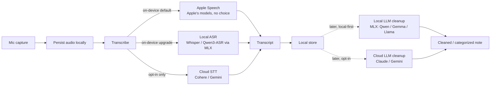

# Relay Notes: Voice-to-Text iOS Build Plan

Native counterpart to [[Note-Organizer-RN-Build-Plan]] and [[Local-LLM-Mobile-Stack-Research]]. Decision: **iOS-native (SwiftUI), iPhone 15 Pro Max first**. Cross-platform and the paid product are explicitly deferred.

> [!important] v1 scope: voice-to-text only
> Tap, speak, get a stored transcript. That is the whole product for v1. Cleanup, organization, categorization, and any local-LLM enrichment are **deferred** — they were the original thesis of this doc and are preserved below under "Later — LLM enrichment" for when v1 is in daily use and the real shape of "messy notes" is observable.

> [!info] Three constraints that shape v1
> 1. **Local-first by default. Cloud is opt-in.** Some users will never turn cloud on, and the app must be fully functional without it. Cloud STT and cloud LLM enrichment are *upgrades*, not requirements. Default flow: mic → on-device transcribe → on-device store.
> 2. **On-device ≠ Apple-only.** Apple Speech is the easiest on-device starting point because it ships with iOS, but third-party local models (Whisper, Qwen3-ASR via MLX) are *also* on-device and stay in scope as the upgrade path when Apple's models hit a ceiling. "Where it runs" (on-device vs cloud) and "whose model" (Apple's vs your-choice) are independent axes.
> 3. **First and foremost it works for me.** v1 ships to my own phone via Developer Mode sideload (free Apple ID tier). TestFlight, paid Apple Developer Program enrollment, App Store and pricing are all later, optional concerns — each tied to a concrete trigger, not a fixed date.

> [!tip] The principle (still applies, at a smaller surface)
> Provider abstraction from day one — define a `Transcriber` protocol with interchangeable implementations (Apple Speech on-device, your-choice local ASR on-device, opt-in cloud STT). "Which transcriber" becomes a runtime choice, never a rebuild. The same pattern extends to language models when the LLM stages come back in scope.

---

## The pipeline



**v1 is the solid path:** mic → persist → transcribe → store. The cloud transcription branch (`C3`) is opt-in only and stays off by default. The dotted "Later" stage exposes the same local-first / opt-in-cloud pattern for LLM enrichment (cleanup, categorize) — Apple Foundation Models are intentionally *not* a primary engine; the open-source ecosystem (Qwen, Gemma, Llama via MLX) is ahead on capability in 2026.

---

## The spine

### v1 — just `Transcriber`

```swift
protocol Transcriber: Sendable {
    func transcribe(_ audio: URL, options: TranscriptionOptions) async throws -> String
}

struct TranscriptionOptions: Sendable {
    var preset: SpeechTranscriber.Preset = .transcription
    var contextualStrings: [String] = []
}
```

Providers, all interchangeable behind one protocol:
- **`AppleSpeechTranscriber`** — on-device, Apple's models. v1 default. Uses `SpeechAnalyzer` + `SpeechTranscriber`. Easiest to ship; no model choice.
- **`LocalASR`** — on-device, your-choice models. Whisper or Qwen3-ASR via MLX / whisper.cpp. The escape hatch when Apple's accuracy is the bottleneck *and* you want to stay local.
- **`CloudTranscriber`** — cloud, opt-in only. Cohere (best published WER) / Gemini (best diarization). Off by default.

The `options` parameter is what makes the four V1.1 accuracy knobs runtime-tunable per call — see "V1.1 accuracy tuning."

### Later — `LanguageModel`

```swift
protocol LanguageModel {
    func clean(_ raw: String) async throws -> String
    func categorize(_ note: String, into allowed: [String]) async throws -> Categorization
}
```

Providers (same local-first / cloud-opt-in pattern as the `Transcriber` protocol):
- **`LocalModel`** — on-device, your-choice models. **MLX primary** (Qwen3 4B, Gemma 3 4B, Llama 3.2 3B), **llama.cpp fallback**, **LiteRT-LM** as a third engine to compare. The default cleanup path.
- **`CloudModel`** — cloud, opt-in only. Claude / Gemini / Command. Off by default; user explicitly turns it on for accuracy upgrade.
- **`AppleFoundation`** — *optional, not recommended as primary.* Apple is behind the open-source LLM ecosystem on capability and instruction-following as of mid-2026; we treat their models as a fourth provider for users who specifically want OS-integrated inference, not as the default.

Centralize the prompt and pin a fixed category taxonomy so swapping any provider never changes behavior. The model picks from `allowed`, it never invents categories.

---

# Later — LLM enrichment (deferred)

Everything below was the original "local-LLM-on-device" thesis. Preserved as-is because the research is still good — just not v1. Revisit once v1 is in daily use and you have real captured notes to validate against.

## Inference engine

For "my choice of local model" on Apple silicon, the 2026 consensus is MLX primary, llama.cpp fallback. **LiteRT-LM** (Google's on-device runtime, ships Gemma 4 E2B with official iOS support) is a third option worth comparing when this work resumes — see References.

> [!important] Why not Apple Foundation Models as the primary engine?
> As of mid-2026, Apple's on-device language models lag the open-source ecosystem (Qwen, Gemma, Llama) on capability and instruction-following. They are the easiest to integrate (no model download, no entitlement gymnastics) but the *least capable* of the available options. We treat Apple Foundation Models as a fourth, optional engine — useful for users who specifically want OS-integrated inference — not the default. The default is your-choice via MLX.

- **MLX is the default first pick on Apple devices:** fastest, dead-simple from Swift, and `mlx-community` on Hugging Face ships conversions of new models quickly. It is also the only local path that supports LoRA fine-tuning if you ever want to specialize on your own notes.
- **llama.cpp (GGUF) is the universal fallback:** the broader format ecosystem, so anything MLX has not converted is available as a GGUF within days. Runs ~15 to 30 tok/sec on A17 Pro and later via Metal.

> [!tip] The "space moves fast" mechanism
> Models are downloaded at runtime from Hugging Face into the app container, not bundled. The model picker is just a list of HF repo ids. A better model drops next month, you add an id, no app update. Optionally bundle one default model so first run works offline before any download.

**Ready-made option:** `LocalLLMClient` (tattn, MIT) wraps both GGUF and MLX on iOS and macOS, with streaming and Hugging Face download built in. It is marked experimental (API may change). Alternative: roll a thin protocol over `mlx-swift` plus a vendored `llama.cpp` xcframework (git submodule to track upstream).

---

## Models for iPhone 15 Pro Max (8 GB)

Sweet spot is 3B to 4B at 4-bit. A 4B Q4 is roughly 2.5 GB and snappy.

- **Default:** Qwen3 4B (Apache 2.0, strong, clean license)
- **Alternatives:** Gemma 3 4B, Llama 3.2 3B, Phi-4-mini
- **Headroom option:** step down to 1B to 2B if memory pressure shows up

Add the **Increased Memory Limit** entitlement. Even with it, 8 GB is tight, so test for memory kills under real use.

---

## Model support progression

### Transcription tiers

| Tier | Provider | Where it runs | Model choice | When |
|---|---|---|---|---|
| **1** | Apple Speech (`SpeechAnalyzer`) | on-device | none — Apple's models | v1 |
| **2** | Local ASR — Whisper / Qwen3-ASR via MLX or whisper.cpp | on-device | your choice (HF repo id) | post-v1, when Apple's accuracy is the bottleneck *and* staying local matters |
| **3** | Cloud STT — Cohere / Gemini | cloud (opt-in) | provider's hosted | post-v1, **off by default**; user explicitly enables |

### Cleanup / categorize tiers

Sequencing *within* the Later work, once L stages resume.

| Tier | What | How | When |
|---|---|---|---|
| **0** | Validation, no app | Run candidate MLX models on real notes; sanity-check the ceiling with a cloud model | L0 |
| **1** | One local model | MLX behind `LanguageModel`, downloaded from HF | L1–L2 |
| **2** | Model picker | Multiple HF models, runtime download, llama.cpp fallback | L2+ |
| **3** | Cloud enrichment | Cloud frontier model when online, local as offline fallback, queue drains on reconnect | L4 |
| **4** | Optional | Apple Foundation Models, LiteRT-LM (Gemma 4 E2B), or LoRA fine-tune via MLX | L5 |

---

## Build roadmap

Sequenced for ~12 hrs/week, iPhone-first.

### v1 — voice-to-text on my phone

- [x] **V1.0 — Skeleton.** SwiftUI app builds and installs on iPhone 15 Pro Max via Developer Mode. *(2026-06-08)*
- [x] **V1.1 — Capture + transcribe.** `AVAudioRecorder` writes `.m4a`/AAC to the app container; Apple `SpeechAnalyzer` + `SpeechTranscriber` transcribes the file on-device; transcripts persist via SwiftData. `Transcriber` protocol with file-based contract (`transcribe(_:options:)`). Mic + speech permissions wired (`NSMicrophoneUsageDescription`, `NSSpeechRecognitionUsageDescription`), audio session configured. Runtime-tunable accuracy knobs (mode / bitrate / preset / contextual strings) persisted via `UserDefaults`. *(2026-06-08)*
  *Status: speak → stored transcript on-device — working. Accuracy tuning ongoing in parallel; see V1.1 accuracy tuning section.*
  *`AVAudioEngine` swap shipped in V1.2 stretch (live streaming).*
- [x] **V1.2 — Transcription UX.** Make it usable daily. *(2026-06-08)*
  - [x] Notes list — chronological, newest first; date + transcript preview snippet. List + record button on a single screen (Voice Memos pattern). *(2026-06-08)*
  - [x] Note detail view — full transcript (selectable) + audio playback (play/pause + scrub bar). `AudioPlayer` (`@Observable`) wraps `AVAudioPlayer`, with a Task-based polling loop driving the progress UI. *(2026-06-08)*
  - [x] Delete a note — swipe-to-delete on the list, trash button + confirmation alert in detail view, removes both the SwiftData row and the audio file from disk. *(2026-06-08)*
  - [x] Search across transcripts — `.searchable` on the navigation stack, in-memory case-insensitive filter via `String.localizedCaseInsensitiveContains`. Empty-state distinguishes "no notes yet" from "no matches for '<query>'" via `ContentUnavailableView.search(text:)`. *(2026-06-08)*
  - [x] (Stretch) Rename / give a title — `Note.title: String?` (nil = auto-titled from first 6 transcript words with ellipsis). `displayTitle` falls back gracefully. List row leads with title; date and transcript snippet underneath. Detail view has an inline-editable title field at the top; commits on submit or screen-leave. *(2026-06-08)*
  - [x] (Stretch) Share transcript text — `ShareLink` in `NoteDetailView` toolbar, sharing `note.transcript` with `note.displayTitle` as subject. Disabled when the transcript is whitespace-only. Audio-file sharing intentionally out of scope. *(2026-06-08)*
  - [x] (Stretch) Live streaming transcription — swapped `AVAudioRecorder` for `AVAudioEngine`. New `LiveAudioEngine` taps the mic, writes AAC/m4a to disk *and* streams PCM buffers (converted to the analyzer's preferred format) to a `TranscriptionSession`. `AppleSpeechTranscriber.makeStreamingSession` wraps `SpeechAnalyzer.start(inputSequence:)` and yields cumulative partials (final + volatile) into the view. Partial transcript renders live in `RecorderView` above the record button. *(2026-06-08)*
  *Done when: you reach for this daily instead of stock Voice Memos.*
- [ ] **V1.3 — Dogfood via sideload.** Build to your phone via Developer Mode and use it as your real notes app. Free Apple ID tier is fine — the bundle expires every 7 days; replug and re-run from Xcode and the data container persists (SwiftData rows + audio files survive the re-sign because bundle ID is stable). No paid Apple Developer Program enrollment yet.
  *Done when: it's on your home screen and you use it daily for a week or two.*
- [ ] **V1.4 — TestFlight (optional, gated).** Enroll in the Apple Developer Program ($99/yr) and ship a TestFlight build. Deferred until after **L1** — validating that on-device MLX inference actually works on the phone is the trigger for committing to the paid program. Earlier signals that would also pull this forward: wanting to hand the app to someone else, or the 7-day re-plug cycle becoming friction.
  *Done when: build is on TestFlight, installed via the TestFlight app, no need to re-plug to a Mac for weeks.*

### Later — LLM enrichment (deferred until v1 is in daily use)

- [ ] **L0 — Validation.** Desktop. Run candidate local models (Qwen3 4B and friends, via Ollama or MLX) against 20-30 real captured notes. Lock the prompt and taxonomy. Pick the local cleanup model. Sanity-check the ceiling with a cloud frontier model.
  *Done when: you trust a local model on your own notes.*
- [ ] **L1 — Inference spike.** Wire `LocalLLMClient` or `mlx-swift`, download a model from HF, generate on the 15 Pro Max. Add the Increased Memory Limit entitlement. Measure tok/sec, load time, memory, battery.
  *Done when: a downloaded model streams text on your phone. Riskiest integration, prove it first when L stages resume.*
- [ ] **L2 — Cleanup pass.** Wire the local model behind `LanguageModel`. Transcript in, cleaned note out. Model stays swappable.
  *Done when: a messy spoken note comes back clean.*
- [ ] **L3 — Categorize / organize.** Pinned taxonomy. Local or cloud.
- [ ] **L4 — Cloud enrichment.** `CloudModel` provider plus an offline queue that drains on reconnect. Cloud STT accuracy pass.
- [ ] **L5 — Optional.** Apple Foundation Models provider, LiteRT-LM (Gemma 4 E2B), or a LoRA fine-tune via MLX.

---

## Progress log

> [!info] Moved
> The running narrative now lives in [../CHANGE_LOG.md](../CHANGE_LOG.md) at the repo root. This doc stays focused on the *plan* (what we intend to build, why, and the design decisions). New ship entries go in `CHANGE_LOG.md` per the rule in [../CLAUDE.md](../CLAUDE.md).

---

## V1.1 accuracy tuning

> [!tip] Companion doc
> [transcription-tuning.md](./transcription-tuning.md) explains *what each knob does and why we chose its default*. This section records *what we observed empirically when we turned them*.

All four knobs are **runtime-configurable** via the in-app Tuning sheet (slider icon, top-right). Track outcomes here.

Defaults out of the box: `.default` · 64 kbps · basic preset · no contextual strings.

| # | Knob | Values to try | Status | Outcome |
|---|---|---|---|---|
| 1 | Audio session mode | `.default` (general processing) / `.measurement` (raw, no AGC/noise-gate) / `.voiceChat` (VoIP echo cancellation) / `.videoRecording` | partly done | `.measurement` produces noticeably quieter playback than `.default` due to disabled AGC; no observable STT accuracy benefit in tested noisy conditions. Reverted default to `.default`. `.measurement` remains an opt-in for STT-focused testing. |
| 2 | AAC bitrate | 32, 64, 96, 128, 192 kbps | not started | — |
| 3 | Transcription preset | `.transcription` (basic) / `.transcriptionWithAlternatives` / `.progressiveTranscription` | not started | — |
| 4 | Contextual biasing | Comma-separated domain words via `AnalysisContext.contextualStrings[.general]` | not started | — |

Notes:
- `.spokenAudio` was initially considered but is documented as a *playback* mode (podcasts, audiobooks), not a recording mode. The right recording-side knob is `.measurement`.
- Mode + bitrate changes are cheap and address broad audio-quality issues. Preset + biasing address recognizer-side issues. Try cheap first.
- Contextual biasing is documented for `DictationTranscriber`; effect on `SpeechTranscriber` is untested — record outcome here.
- Tuning state persists across launches via `UserDefaults` (each property has a `didSet` that writes its value; `init` reads back). Reset by deleting and reinstalling the app, or wiring up a "Reset to defaults" button later.

---

## Architecture notes

### v1
- **Local-first by default; cloud is opt-in.** The app must be fully functional with no network. Cloud STT exists as an upgrade path users explicitly enable; it never runs implicitly.
- **On-device ≠ Apple-only.** v1 uses `AppleSpeechTranscriber` because it ships with iOS, but `LocalASR` (Whisper / Qwen3-ASR via MLX) is also on-device and slots in behind the same protocol when Apple's accuracy is the limit.
- **Provider abstraction from day one.** `Transcriber` protocol with three concrete providers (`AppleSpeechTranscriber`, `LocalASR`, `CloudTranscriber`). Options struct (`TranscriptionOptions`) keeps the per-call config runtime-tunable.
- **Transcription off the main thread.** Recording (`AVAudioRecorder`) and transcription (`SpeechAnalyzer` actor) both run async; the view never blocks. V1.1 is file-based — live streaming partial results into the view is a V1.2 stretch.
- **Local-first persistence.** SwiftData for transcripts. Audio files in the app container, referenced by filename (not absolute URL, since the container path can shift between launches).

### Later (LLM enrichment)
- **Local-first by default; cloud is opt-in.** Same pattern as transcription. Local LLM (MLX) is the default cleanup path; cloud LLM (Claude / Gemini) is an explicit upgrade.
- **Engine abstraction from day one of the L stages.** MLX primary, llama.cpp fallback, LiteRT-LM as a third option, Apple Foundation as an optional fourth. All behind `LanguageModel`. New models land as MLX / GGUF / LiteRT at different times; multi-engine covers all.
- **Why not Apple-only:** Apple's on-device LLMs lag the open-source ecosystem (Qwen, Gemma, Llama) on capability as of 2026. They're the easiest to integrate but the least capable; default is your-choice via MLX, not Apple Foundation.
- **Runtime model management.** Download from Hugging Face into the app container. Bundle at most one small default for first-run offline.
- **Generation off the main thread.** Stream tokens into the view.
- **Prompt and taxonomy in one place.** Every provider imports them.

---

## Watch-items

> [!warning] v1 risks (voice-to-text)
> - **Apple Speech setup.** Request on-device recognition explicitly, handle locale and authorization. Permissions: `NSMicrophoneUsageDescription`, `NSSpeechRecognitionUsageDescription`. Configure the audio session for recording.
> - **Background recording.** If you want capture while the screen is locked, you need the background audio mode and a long-lived audio session — easy to get wrong.
> - **Single-platform lock-in.** Revisiting cross-platform later means a rebuild. This is the conscious tradeoff for shipping the best thing on your phone now.

> [!warning] Later risks (LLM enrichment, when it resumes)
> - **iOS memory limits.** Even with the Increased Memory Limit entitlement, 8 GB is tight. 3B to 4B Q4 is the ceiling. Test for jetsam kills under real use.
> - **`LocalLLMClient` is experimental.** API may change. Have the roll-your-own path (mlx-swift + llama.cpp xcframework) as a fallback if it churns.
> - **MLX vs GGUF vs LiteRT-LM availability lag.** A new model may appear in one format before the others. Engine abstraction is what makes this a non-issue.
> - **First-load model latency.** After download, the first run compiles and loads. Show progress.
> - **Licensing.** Qwen is Apache 2.0 and clean. Gemma 4 E2B is Apache 2.0 too. If this ever becomes a paid product, re-check the license of whatever model you ship or default to.

---

## References

- **Brown CCV — Comparing speech-to-text models:** https://docs.ccv.brown.edu/ai-tools/services/transcribe/comparing-speech-to-text-models
  Compares Cohere Transcribe (5.42% WER, best published), Qwen3-ASR (5.76%, ~1.2–1.5× faster than Whisper), OpenAI Whisper (7.44%), and Google Gemini (unpublished WER, strong diarization). Reinforces the v1 cloud-STT plan: Cohere for accuracy on noisy / accented audio, Gemini for short clips and diarization.
- **Gemma 4 E2B (LiteRT-LM) on Hugging Face:** https://huggingface.co/litert-community/gemma-4-E2B-it-litert-lm
  Google's on-device language model (~2.6 GB, Apache 2.0). Runtime is **LiteRT-LM**, not MLX or llama.cpp — would be a third engine option behind `LanguageModel`. Has official iOS support via Google AI Edge Gallery. Worth a row in L5 — Optional.

---

## Content angle

Every phase is an AlteredCraft post.

- **v1 posts:** local-first design (cloud opt-in only, not implicit) on iOS in 2026, the Apple Speech on-device floor, `SpeechAnalyzer` + `SpeechTranscriber` from `AVAudioRecorder`-captured AAC in SwiftUI for a developer who lives in TypeScript, runtime accuracy tuning (mode / bitrate / preset / contextual biasing) as a debug surface, file-based vs live-streaming STT tradeoffs, the on-device-but-not-Apple option (Whisper / Qwen3-ASR via MLX), and the STT model landscape (Cohere / Gemini / Whisper / Qwen3-ASR).
- **Later posts:** MLX vs llama.cpp vs LiteRT-LM on a real iPhone, runtime model swapping from Hugging Face, and the local-capture-cloud-enrich pattern.

The build funds the content.
