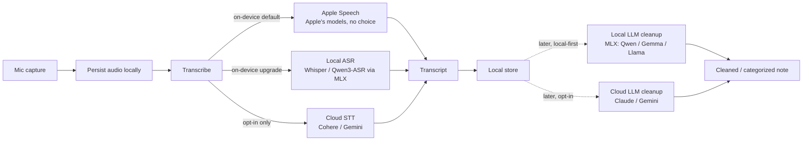

# Relay Notes: Voice-to-Text iOS Build Plan

iOS-native (SwiftUI), iPhone 15 Pro Max first. Cross-platform and any paid product are explicitly deferred.

This doc is the **plan and the why**. The chronological "what shipped" narrative lives in [CHANGE_LOG.md](../CHANGE_LOG.md); transcription dial rationale lives in [transcription-tuning.md](./transcription-tuning.md). Bulky reference material (the deferred LLM research, the empirical tuning log) is in the [Appendix](#appendix) and linked from the body.

> [!important] v1 scope: voice-to-text only
> Tap, speak, get a stored transcript. That is the whole product for v1. Cleanup, organization, categorization, and any local-LLM enrichment are **deferred** to the "Later — LLM enrichment" stages, for when v1 is in daily use and the real shape of "messy notes" is observable.

> [!info] Three constraints that shape v1
> 1. **Local-first by default. Cloud is opt-in.** The app must be fully functional with no network. Cloud STT and cloud LLM enrichment are *upgrades*, not requirements. Default flow: mic → on-device transcribe → on-device store.
> 2. **On-device ≠ Apple-only.** Apple Speech is the easiest on-device start because it ships with iOS, but third-party local models (Whisper, Qwen3-ASR via MLX) are *also* on-device and stay in scope as the upgrade path when Apple's models hit a ceiling. "Where it runs" (on-device vs cloud) and "whose model" (Apple's vs your-choice) are independent axes.
> 3. **First and foremost it works for me.** v1 ships to my own phone via Developer Mode sideload (free Apple ID tier). TestFlight, the paid Apple Developer Program, App Store, and pricing are later, optional concerns — each tied to a concrete trigger, not a date.

> [!tip] The load-bearing principle
> **Provider abstraction from day one.** Every external capability sits behind a protocol so the runtime provider is swappable without a rebuild — `Transcriber` today, `LanguageModel` when the LLM stages resume. "Which provider" is a runtime choice. This is the spine; preserve it.

---

## Where we are now (2026-06-12)

v1 voice-to-text is **built and on-device**. Tap → speak → stored transcript works, with two interchangeable on-device engines selectable in Settings:

- **Apple Speech** (default) — `SpeechAnalyzer` + `SpeechTranscriber`, streams live partials while recording.
- **On-device Whisper** — `whisper-small.en` (481 MB FP16) via raw `mlx-swift`, downloaded on first use into Application Support, finalize-only decode (no live partials — placeholder UX while recording).

Daily-driver UX shipped: chronological list, detail view with audio playback, delete (row + audio file), search, optional title, share. The provider spine is in place and load-bearing: `Transcriber` (file + streaming), `TranscriptionEngine` + `TranscriberFactory`, the `TranscriptionOptions` sum type, and per-engine settings bundles (Approach C). Persistence is SwiftData (`Note`) + audio files referenced by filename. Verified by 84 simulator tests (MLX paths are device-only) plus device validation on the iPhone 15 Pro Max.

**Next:** T1.3 (on-device load/decode/memory/battery measurements), then dogfood via sideload (V1.3). LLM enrichment (L1–L5) stays deferred until v1 is in daily use.

---

## The pipeline



**v1 is the solid path:** mic → persist → transcribe → store. The cloud branch (`C3`) is opt-in and off by default. The dotted "Later" stage repeats the same local-first / opt-in-cloud pattern for LLM enrichment — Apple Foundation Models are intentionally *not* a primary engine (the open-source ecosystem leads on capability in 2026).

---

## The spine

### v1 — `Transcriber` (current)

```swift
nonisolated protocol Transcriber: Sendable {
    // File-based. Reserved for cloud STT and a future "re-transcribe this note" action; unused by the app today.
    func transcribe(_ audio: URL, options: TranscriptionOptions) async throws -> String
    // Live. What the recorder uses; returns a session the audio engine feeds.
    func makeStreamingSession(options: TranscriptionOptions) async throws -> any TranscriptionSession
}

enum TranscriptionOptions: Sendable {
    case apple(AppleSpeechOptions)   // preset + contextual strings
    case whisperMLX                  // no decode dials in v1
}
```

- Two methods, both intentional — file-based stays for the cloud/re-transcribe paths even though the app only uses streaming today. Don't delete it as dead code.
- `TranscriptionOptions` is a **sum type**, not a struct with nullable fields — each engine's options stay type-safe and it mirrors `TranscriptionEngine`. Per-engine settings live in bundles on `Tunings` (Approach C, see transcription-tuning.md).

Providers (interchangeable behind the protocol):
- **`AppleSpeechTranscriber`** — on-device, Apple's models. v1 default.
- **`WhisperMLXTranscriber`** — on-device, your-choice model via raw `mlx-swift`. The upgrade when Apple's accuracy is the bottleneck and staying local matters.
- **`CloudTranscriber`** — cloud, opt-in only (Cohere / Gemini). Off by default. *(T3, not built.)*

### Later — `LanguageModel`

```swift
protocol LanguageModel {
    func clean(_ raw: String) async throws -> String
    func categorize(_ note: String, into allowed: [String]) async throws -> Categorization
}
```

Same local-first / cloud-opt-in pattern: **`LocalModel`** (MLX primary, llama.cpp fallback, LiteRT-LM as a third) is the default cleanup path; **`CloudModel`** (Claude / Gemini) is opt-in; **`AppleFoundation`** is an optional fourth, *not* the default (see [Appendix A](#a-llm-enrichment--engine--model-research-deferred)). Centralize the prompt and pin a fixed category taxonomy so swapping providers never changes behavior — the model picks from `allowed`, it never invents categories.

---

## Build roadmap

Sequenced for ~12 hrs/week, iPhone-first. Completed stages are one-liners — the detail is in CHANGE_LOG.

### v1 — voice-to-text on my phone

- [x] **V1.0 Skeleton** — SwiftUI app builds + sideloads. *(2026-06-08)*
- [x] **V1.1 Capture + transcribe** — `AVAudioEngine` → AAC/m4a + `SpeechAnalyzer` streaming → SwiftData; mic/speech permissions; runtime-tunable accuracy knobs. *(2026-06-08)*
- [x] **V1.2 Transcription UX** — list, detail + playback, delete (row + audio), search, optional title, share, live-streaming partials (Apple). *(2026-06-08/09)*
- [ ] **V1.3 — Dogfood via sideload.** Build to the phone via Developer Mode and use it as the real notes app. Free Apple ID tier (bundle expires every 7 days; re-plug and re-run, data container persists). No paid program yet.
  *Done when: it's on the home screen and used daily for a week or two.*
- [ ] **V1.4 — TestFlight (optional, gated).** Enroll in the Apple Developer Program ($99/yr) and ship a TestFlight build. **Trigger:** wanting to hand the app to someone else, or the 7-day re-plug cycle becoming friction. No longer Whisper-memory-gated — `small.en` runs without the increased-memory-limit entitlement (validated 2026-06-10).
  *Done when: installed via TestFlight, no Mac re-plug for weeks.*

### Transcription upgrades (ahead of L stages)

Promoted ahead of L1 on 2026-06-10: **third-party-model on-device viability is the riskiest unknown of the local-first thesis**, and the runtime wired here (raw `mlx-swift`) is the same one L1+ needs for local LLMs. Do the hard thing first, on a smaller problem than an LLM.

- [x] **T1.0–T1.2 — Local Whisper wired end-to-end, device-validated.** Provider plumbing (sum type, `TranscriberFactory`) → `WhisperModelStore` (download / integrity / delete) → cached `actor` transcriber → chunked timestamp-guided decode (handles >30 s audio) → finalize-only streaming session → Settings download/delete UI + engine gating → recorder placeholder UX. Weights are download-only (`.app` ~74 MB). Device-validated on the iPhone 15 Pro Max through 2026-06-12. Per-substage detail in CHANGE_LOG; dial/port rationale in transcription-tuning.md.
- [ ] **T1.3 — Validation + measurements + decisions log.** On-device smoke test against a checked-in WAV (assert substring). Measure on the iPhone 15 Pro Max for a 1-min and a 5-min note: model load, decode time, peak resident memory, battery delta. Append a "T1 measurements" subsection here + a Decisions-log row in transcription-tuning.md. Revisit `small.en` vs a smaller variant if the numbers demand it.
  *Done when: tests green, measurements captured, defaults revisited if needed.*
- [ ] **T2 — Second on-device engine.** Parakeet-MLX (NVIDIA, CC-BY-4.0) or Qwen3-ASR via MLX behind the same protocol — validates the runtime-extensibility claim and gives an accuracy ladder. Heavier than Whisper-small (~0.6B / ~2 GB) — likely needs the increased-memory-limit entitlement (L1's prerequisite anyway).
  *Done when: a second on-device engine is selectable and produces transcripts on the phone.*
- [ ] **T3 — Cloud STT (`CloudTranscriber`).** Cohere as accuracy primary, Gemini for diarization-heavy clips. **Off by default**, explicit opt-in with a one-time data-leaves-the-device disclosure.
  *Done when: with the toggle on, a transcript comes back from a remote provider; with it off, no network call leaves the device.*

### Later — LLM enrichment (deferred until v1 is in daily use)

Extends the same provider pattern to `LanguageModel`. Engine/model research detail is in [Appendix A](#a-llm-enrichment--engine--model-research-deferred).

- [ ] **L1 — Inference spike.** Wire `mlx-swift` (or `LocalLLMClient`), download a model from HF, generate on the 15 Pro Max, add the increased-memory-limit entitlement. Measure tok/sec, load, memory, battery. *Riskiest integration — prove it first when L stages resume.*
- [ ] **L2 — Cleanup pass.** Local model behind `LanguageModel`; messy spoken note in, clean note out. Model stays swappable.
- [ ] **L3 — Categorize / organize.** Pinned taxonomy. Local or cloud.
- [ ] **L4 — Cloud enrichment.** `CloudModel` + an offline queue that drains on reconnect; cloud STT accuracy pass.
- [ ] **L5 — Optional.** Apple Foundation Models provider, LiteRT-LM (Gemma 4 E2B), or a LoRA fine-tune via MLX.

---

## Architecture notes

### v1

- **Local-first by default; cloud is opt-in.** Fully functional with no network. Cloud STT is an upgrade users explicitly enable; it never runs implicitly.
- **On-device ≠ Apple-only.** `AppleSpeechTranscriber` ships first because it's built into iOS, but `WhisperMLXTranscriber` is also on-device and slots in behind the same protocol when Apple's accuracy is the limit.
- **Provider abstraction from day one.** `Transcriber` with concrete providers; `TranscriptionEngine` + `TranscriberFactory` resolve the engine per recording; `TranscriptionOptions` is a sum type so per-engine options stay type-safe. (All shipped — see "The spine.")
- **Transcription off the main thread.** Capture and transcription run async; the view never blocks. Apple streams partials into the view; Whisper decodes once at finalize.
- **Local-first persistence.** SwiftData for transcripts; audio files in the container, referenced by **filename** (not absolute URL — the container path can shift between launches). `Note.deleteWithAudio(in:)` is the canonical delete.

### Later (LLM enrichment)

- **Local-first by default; cloud is opt-in.** Same as transcription. Local LLM (MLX) is the default cleanup path; cloud is an explicit upgrade.
- **Engine abstraction from day one of the L stages.** MLX primary, llama.cpp fallback, LiteRT-LM third, Apple Foundation optional fourth — all behind `LanguageModel`. Models land as MLX / GGUF / LiteRT at different times; multi-engine covers all.
- **Why not Apple-only:** Apple's on-device LLMs lag the open-source ecosystem (Qwen, Gemma, Llama) on capability as of 2026. Easiest to integrate, least capable. Default is your-choice via MLX.
- **Runtime model management.** Download from Hugging Face into the container; bundle at most one small default for first-run offline. **Generation off the main thread**, streaming tokens into the view. Prompt + taxonomy centralized so every provider imports them.

---

## Watch-items

> [!warning] v1 risks (voice-to-text)
> - **Apple Speech setup.** On-device recognition requested explicitly; locale + authorization handled. Permissions `NSMicrophoneUsageDescription` / `NSSpeechRecognitionUsageDescription`; audio session configured. *(Shipped.)*
> - **Background recording.** Locked-screen capture works — `audio` background mode via the partial `Info.plist`; `AVAudioSession` interruption handling (call/alarm/Siri → pause + auto-resume) shipped 2026-06-09. **Still open:** audio route changes (e.g. unplugging headphones) and on-device validation of the backgrounded-during-a-call path.
> - **Single-platform lock-in.** Revisiting cross-platform later means a rebuild — the conscious tradeoff for shipping the best thing on the phone now.

> [!warning] T1 risks (Local Whisper via MLX)
> - **In-memory PCM buffer ceiling.** `WhisperMLXTranscriber` accumulates PCM in memory and decodes at `finish()` — ~115 MB for a 30-min recording on the 15 Pro Max. Fine, not unbounded. Revisit trigger: recordings >20 min, memory-pressure warnings under dogfood, or expanding the device target. Tracked in [#1](https://github.com/AlteredCraft/relay-notes/issues/1).
> - **Model download is a ~481 MB step.** `mlx-community/whisper-small.en-fp16` (`model.safetensors`, pinned commit, SHA-verified) lives in Application Support (not Caches — evictable), excluded from iCloud backup. Settings exposes pre-download + delete to keep the offline-recording promise once installed.
> - ~~`increased-memory-limit` entitlement vs free-tier sideload.~~ **Resolved 2026-06-10:** not required for `small.en` FP16 on the 15 Pro Max (validated end-to-end without it). Still applies to L1+ MLX LLMs (3–4B Q4 ≈ 2.5 GB), but Whisper alone doesn't trip it.

> [!warning] Later risks (LLM enrichment, when it resumes)
> - **iOS memory limits.** Even with the entitlement, 8 GB is tight — 3–4B Q4 is the ceiling. Test for jetsam kills under real use.
> - **`LocalLLMClient` is experimental.** Keep the roll-your-own path (mlx-swift + llama.cpp xcframework) as a fallback if it churns.
> - **Format availability lag (MLX / GGUF / LiteRT-LM).** Engine abstraction is what makes a new model in one format a non-issue.
> - **First-load latency + licensing.** First run compiles/loads — show progress. Re-check the model license if this ever becomes paid (Qwen / Gemma E2B are Apache 2.0).

---

## References

- **Brown CCV — Comparing speech-to-text models:** https://docs.ccv.brown.edu/ai-tools/services/transcribe/comparing-speech-to-text-models — Cohere Transcribe (5.42% WER, best published), Qwen3-ASR (5.76%, faster than Whisper), Whisper (7.44%), Gemini (strong diarization). Backs the v1 cloud-STT plan: Cohere for accuracy, Gemini for diarization.
- **Gemma 4 E2B (LiteRT-LM):** https://huggingface.co/litert-community/gemma-4-E2B-it-litert-lm — Google's on-device LM (~2.6 GB, Apache 2.0), LiteRT-LM runtime, official iOS support. A row in L5.

---

## Content angle

Every phase is an AlteredCraft post. **v1:** local-first design on iOS in 2026, the Apple Speech on-device floor, `SpeechAnalyzer`/`SpeechTranscriber` in SwiftUI for a TypeScript developer, runtime accuracy tuning as a debug surface, file-based vs live-streaming STT, on-device-but-not-Apple (Whisper via MLX), the STT model landscape. **Later:** MLX vs llama.cpp vs LiteRT-LM on a real iPhone, runtime model swapping from HF, the local-capture-cloud-enrich pattern. *The build funds the content.*

---

# Appendix

## A. LLM enrichment — engine + model research (deferred)

The original "local-LLM-on-device" thesis. Preserved because the research is still good — just not v1. Revisit once v1 is in daily use and there are real captured notes to validate against.

**Inference engine.** For "my choice of local model" on Apple silicon the 2026 consensus is **MLX primary, llama.cpp fallback**, with **LiteRT-LM** (Google's on-device runtime, ships Gemma 4 E2B with official iOS support) as a third to compare.

> [!important] Why not Apple Foundation Models as the primary engine?
> As of mid-2026 Apple's on-device language models lag the open-source ecosystem (Qwen, Gemma, Llama) on capability and instruction-following. Easiest to integrate (no download, no entitlement gymnastics) but the *least capable*. Treated as a fourth, optional engine — not the default.

- **MLX** — fastest and simplest from Swift; `mlx-community` ships conversions of new models quickly; the only local path that supports LoRA fine-tuning on your own notes.
- **llama.cpp (GGUF)** — the universal fallback; broadest format ecosystem; ~15–30 tok/sec on A17 Pro+ via Metal.
- **Runtime download from HF**, not bundled — the model picker is just a list of repo ids; a better model drops, you add an id, no app update. Optionally bundle one small default for first-run offline.
- **Ready-made:** `LocalLLMClient` (tattn, MIT) wraps GGUF + MLX with streaming + HF download (experimental). Alternative: a thin protocol over `mlx-swift` + a vendored `llama.cpp` xcframework.

**Models for the iPhone 15 Pro Max (8 GB).** Sweet spot is 3–4B at 4-bit (~2.5 GB, snappy). Default pick **Qwen3 4B** (Apache 2.0); alternatives Gemma 3 4B / Llama 3.2 3B / Phi-4-mini; step down to 1–2B if memory pressure shows up. Add the increased-memory-limit entitlement and test for jetsam under real use.

**Cleanup / categorize tiers** (sequencing within the Later work):

| Tier | What | How | When |
|---|---|---|---|
| 0 | Validation, no app | Run candidate MLX models on real notes; sanity-check the ceiling with a cloud model | L0 |
| 1 | One local model | MLX behind `LanguageModel`, downloaded from HF | L1–L2 |
| 2 | Model picker | Multiple HF models, runtime download, llama.cpp fallback | L2+ |
| 3 | Cloud enrichment | Cloud frontier when online, local offline fallback, queue drains on reconnect | L4 |
| 4 | Optional | Apple Foundation Models, LiteRT-LM (Gemma 4 E2B), or a LoRA fine-tune via MLX | L5 |

**Transcription tiers** (for reference — Tier 1 + 2 are built; Tier 3 is T3):

| Tier | Provider | Where | Model choice | When |
|---|---|---|---|---|
| 1 | Apple Speech (`SpeechAnalyzer`) | on-device | none (Apple's) | v1 ✅ |
| 2 | Local ASR via MLX (Whisper; Parakeet/Qwen3-ASR follow-ups) | on-device | your choice (HF repo id) | T1 ✅ (Whisper) |
| 3 | Cloud STT (Cohere / Gemini) | cloud (opt-in) | provider's hosted | T3 — off by default |

## B. V1.1 accuracy-tuning empirical log

Per-knob outcomes observed when turning the Apple-Speech dials. *What each dial does and why its default* is in [transcription-tuning.md](./transcription-tuning.md); this is *what we found by turning them.* Out-of-box defaults: `.default` · 64 kbps · basic preset · no contextual strings.

| # | Knob | Values to try | Status | Outcome |
|---|---|---|---|---|
| 1 | Audio session mode | `.default` / `.measurement` / `.voiceChat` / `.videoRecording` | partly done | `.measurement` is noticeably quieter (disabled AGC) with no observable STT win in tested noisy conditions. Reverted default to `.default`; `.measurement` stays an opt-in for STT testing. |
| 2 | AAC bitrate | 32 / 64 / 96 / 128 / 192 kbps | n/a | Doesn't affect transcription in the streaming path (both engines transcribe live PCM, not the saved `.m4a`) — a playback/storage dial only. |
| 3 | Transcription preset | basic / withAlternatives / progressive | not started | — |
| 4 | Contextual biasing | comma-separated domain words | not started | — |

Notes: mode + bitrate are cheap capture/storage knobs; preset + biasing are Apple-Speech-only recognizer knobs (inert under Whisper). Tuning state persists via `UserDefaults` (per-property `didSet`; `init` reads back). Engine-scope detail in transcription-tuning.md § "Engine relevance."
